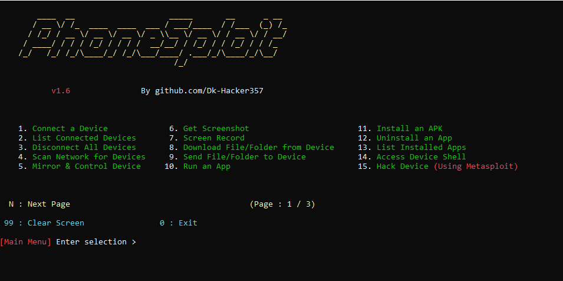
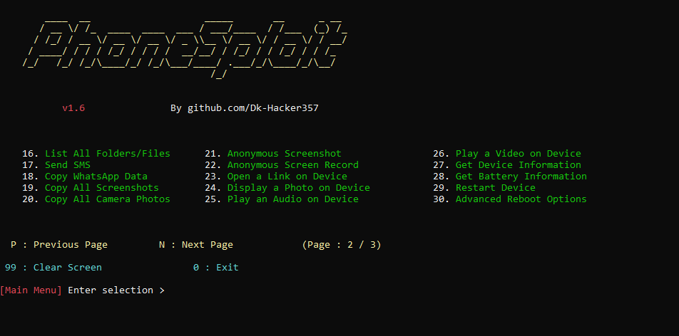
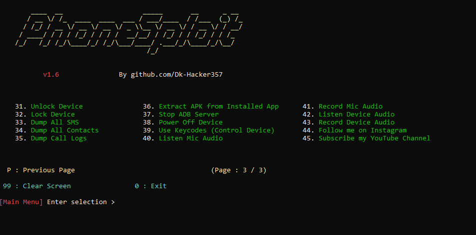

# PhoneSploit

An all-in-one hacking tool written in `Python` to remotely exploit Android devices using `ADB` (Android Debug Bridge) and `Metasploit-Framework`.

> __PhoneSploit__ can also be used as a complete ADB Toolkit to perform various operations on Android devices over Wi-Fi as well as USB. 

# Requirements  
* [`python3`](https://www.python.org/) : Python 3.10 or Latest version
* [`pip`](https://pip.pypa.io/en/stable/installation/) : Package installer for Python
* [`adb`](https://developer.android.com/studio/command-line/adb) : Android Debug Bridge (ADB) from Android SDK Platform Tools
* [`metasploit-framework`](https://www.metasploit.com/) : Metasploit-Framework (`msfvenom` and `msfconsole`)
* [`scrcpy`] : Scrcpy
* [`nmap`](https://nmap.org/) : Nmap

# Run PhoneSploit

> **PhoneSploit** requires Python version 3.10 or above. Please update Python before running the program to meet the requirement.

#### On Linux / macOS :

Open terminal and paste the following commands : 
```
git clone https://github.com/Dk-Hacker357/PhoneSploit.git
```
```
pip install python-nmap
```
```
cd PhoneSploit/
```
```
python3 phonesploit.py
```
#### On Windows :


Open terminal and paste the following commands : 
```
git clone https://github.com/AzeemIdrisi/PhoneSploit.git
```
```
pip install python-nmap
```
```
cd PhoneSploit/
```

# Screenshots






# Tutorial


## Setting up Android Phone for the first time

* __Enabling the Developer Options__

1. Open `Settings`.
2. Go to `About Phone`.
3. Find `Build Number`.
4. Tap on `Build Number` 7 times.
5. Enter your pattern, PIN or password to enable the `Developer options` menu.
6. The `Developer options` menu will now appear in your Settings menu.

* __Enabling USB Debugging__

1. Open `Settings`.
2. Go to `System` > `Developer options`.
3. Scroll down and Enable `USB debugging`.

* __Connecting with Computer__

1. Connect your Android device and `adb` host computer to a common Wi-Fi network.
2. Connect the device to the host computer with a USB cable.
3. Open a terminal in the computer and enter the following command :
```
adb devices
```
4. A pop-up will appear in the Android phone when you connect your phone to a new PC for the first time : `Allow USB debugging?`.
5. Click on `Always allow from this computer` check-box and then click `Allow`.
6. Then in the terminal enter the following command :
```
adb tcpip 5555
```
7. Now you can connect the Android Phone with the computer over Wi-Fi using `adb`.
8. Disconnect the USB cable.
9. Go to `Settings` >  `About Phone` > `Status` > `IP address` and note the phone's `IP Address`.
10. Run __PhoneSploit Pro__ and select `Connect a device` and enter the target's `IP Address` to connect over Wi-Fi.


## Connecting the Android phone for the next time

1. Connect your Android device and host computer to a common Wi-Fi network.
2. Run __PhoneSploit Pro__ and select `Connect a device` and enter the target's `IP Address` to connect over Wi-Fi.


# Disclaimer

* Neither the project nor its developer promote any kind of illegal activity and are not responsible for any misuse or damage caused by this project. This project is for educational purpose only.
Please do not use this tool on other people's devices without their permission. Do not use this tool to harm others. Use this project responsibly on your own devices only. It is the end user's responsibility to obey all applicable local, state, federal, and international laws.
